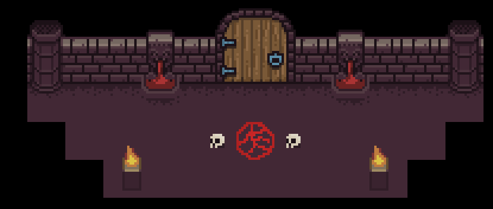
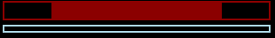
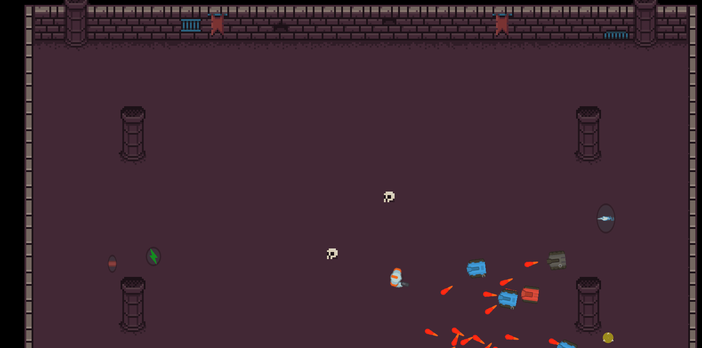
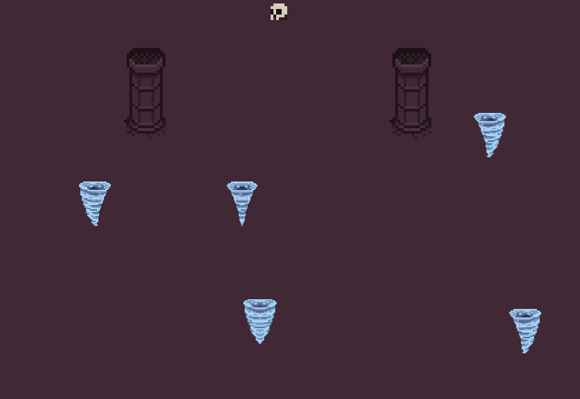
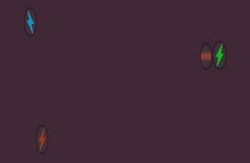
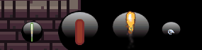
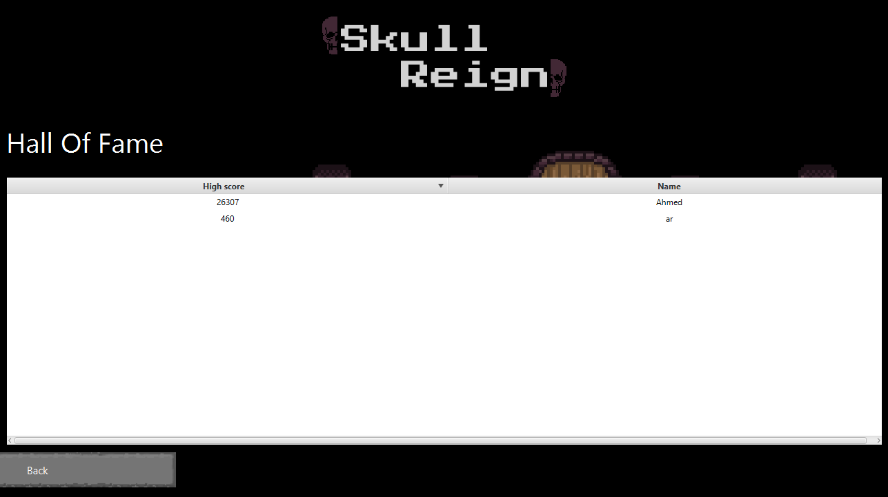

# Skull Reign

<p align="center">
  
</p>

<p align="center">
  
</p>

[](https://www.codacy.com/manual/rameznoshy/skull-reign-2D-topdown-shooter?utm_source=github.com&amp;utm_medium=referral&amp;utm_content=rameziophobia/skull-reign-2D-topdown-shooter&amp;utm_campaign=Badge_Grade)
[![License][license-image]][license-url]

2D Topdown shooter game made using pure Java utilizing the javafx framework

## Videos

[Game Trailer](http://bit.ly/skullreign-yt)

## Features

### Game modes

* endless mode (auto generated endless levels)
* Campaign mode
  * waves
  * boss fight

### Health and Sheild regeneration



### Aiming and different enemy behaviours 



### Obstacles



### Upgrades



### Weapons



### Hall of fame



## Download

To download the game. You can either download the binaries from [here](http://bit.ly/skullreign-dl).

or clone the repo using:

```sh
git clone https://github.com/rameziophobia/skull-reign-2D-topdown-shooter.git
```

## Built With

* [Jetbrains Intellij Idea](https://www.jetbrains.com/idea/): Java IDE
* [Visual Studio Code](https://code.visualstudio.com/): Editor

## Contributing

Please read [CONTRIBUTING.md](https://gist.github.com/PurpleBooth/b24679402957c63ec426) for details on our code of conduct, and the process for submitting pull requests to us.

## Versioning

We use [SemVer](http://semver.org/) for versioning.

## Authors

* **Mohamed Said Sallam** - *Main Developer* - [TheDigitalPhoenixX](https://github.com/TheDigitalPhoenixX)
* **Sameh Amnoun** - *Main Developer* - [SamehAmnoun](https://github.com/SamehAmnoun)
* **Ramez Noshy** - *Main Developer* - [rameziophobia](https://github.com/rameziophobia)
* **Ahmed Mohamed Sadek** - *Main Developer* - [Strykar1](https://github.com/Strykar1)
* **Remon Isaac** - *Main Developer* - [RemonIsaac](https://github.com/RemonIsaac)

See also the list of [contributors](https://github.com/rameziophobia/skull-reign-2D-topdown-shooter/contributors) who participated in this project.

## License

This project is licensed under the MIT License - see the [LICENSE](LICENSE.md) file for details

## Acknowledgments

### Assets

#### Sprites and Images
* https://opengameart.org/content/bosses-and-monsters-spritesheets-ars-notoria
* https://0x72.itch.io/16x16-dungeon-tileset
* https://0x72.itch.io/dungeontileset-ii
* https://opengameart.org/content/crosshair-pack-200%C3%97
* https://opengameart.org/content/skull-4

#### Sounds
* https://freesound.org/people/InspectorJ/sounds/336598/


### Others
* [README template](https://gist.github.com/PurpleBooth/109311bb0361f32d87a2)
* [license-image](https://img.shields.io/badge/License-MIT-brightgreen.svg)
* [license-url](https://opensource.org/licenses/MIT)

